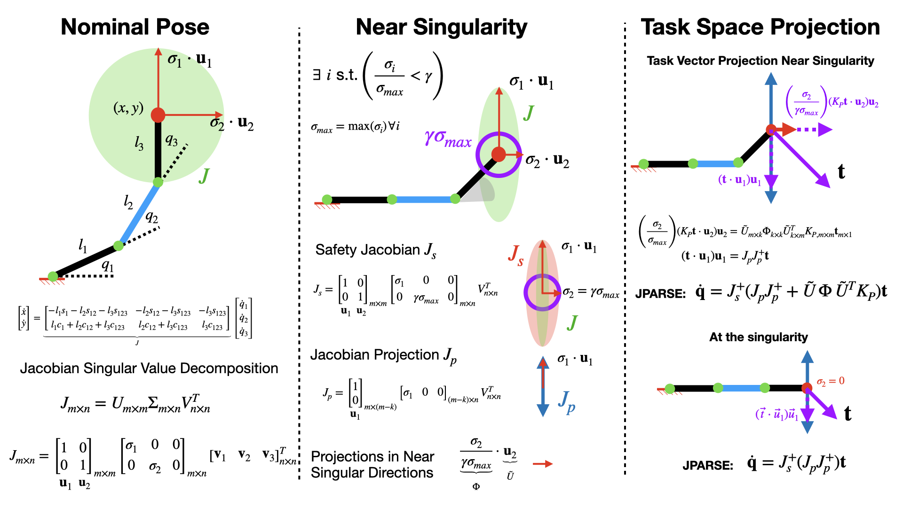
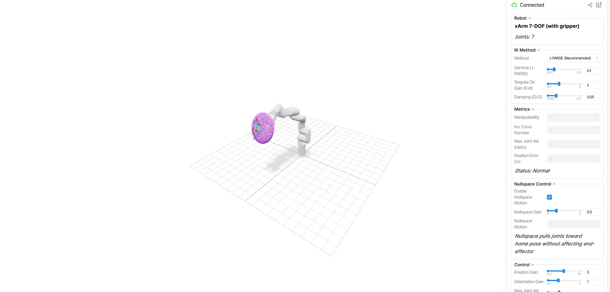
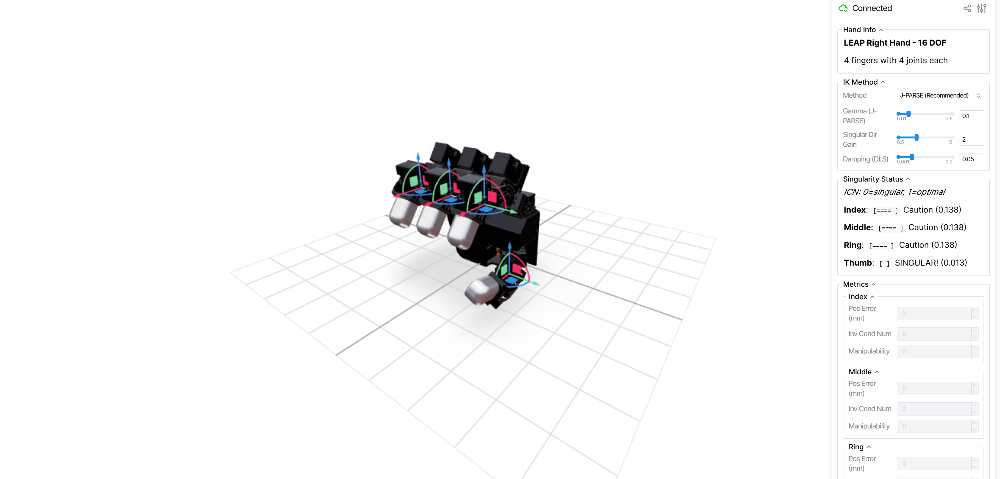

# 🦾 J-PARSE: Jacobian-based Projection Algorithm for Resolving Singularities Effectively in Inverse Kinematic Control of Serial Manipulators


### [Shivani Guptasarma](https://www.linkedin.com/in/shivani-guptasarma/), [Matthew Strong](https://peasant98.github.io/), [Honghao Zhen](https://www.linkedin.com/in/honghao-zhen/), and [Monroe Kennedy III](https://monroekennedy3.com/)


_In Submission_


<!-- 
 -->

[](https://jparse-manip.github.io)
[](https://arxiv.org/abs/2505.00306)

---

## Installation

### Install from PyPI

```bash
pip install jparse-robotics
```

### Install from Source (Development)

```bash
git clone https://github.com/armlabstanford/jparse.git
cd jparse
pip install -e .
```

### With URDF/Pinocchio Support (Optional)

For loading robots from URDF files:

```bash
# Using conda (recommended)
conda install -c conda-forge pinocchio
pip install jparse-robotics

# Or pip only
pip install jparse-robotics pin
```

---

## Quick Start

### Basic Usage (Pure Algorithm)

```python
import numpy as np
import jparse_robotics as jparse

# Create solver
solver = jparse.JParseCore(gamma=0.1)

# Your Jacobian matrix
J = np.array([[-0.707, -0.707],
              [ 0.707,  0.707]])

# Compute J-PARSE pseudo-inverse
J_parse = solver.compute(J)

# Velocity control
desired_velocity = np.array([0.1, 0.1])
joint_velocities = J_parse @ desired_velocity
```

### With URDF Robot Model

```python
import numpy as np
import jparse_robotics as jparse

# Load robot from URDF
robot = jparse.Robot.from_urdf("robot.urdf", "base_link", "ee_link", gamma=0.1)

# Get J-PARSE at a configuration
q = np.zeros(robot.num_joints)
J_parse = robot.jparse(q)

# Velocity control
desired_velocity = np.array([0.1, 0, 0, 0, 0, 0])  # [vx, vy, vz, wx, wy, wz]
joint_velocities = J_parse @ desired_velocity
```

See `examples/` for more detailed examples.

### Interactive 2D Visualization

Try the interactive demo to see J-PARSE in action:

```bash
pip install matplotlib
python examples/visualization_2d.py
```

- **Click** anywhere to set a target position
- **Press 'j'** to toggle between J-PARSE and standard pseudo-inverse
- Watch how J-PARSE keeps joint velocities bounded near singularities!

---

## Pyroki Integration (3D Interactive Visualization)

We have integrated J-PARSE with [pyroki](https://github.com/chungmin99/pyroki) for interactive 3D visualization with real robot models!



### Installation

```bash
pip install jparse-robotics pyroki viser robot-descriptions yourdfpy
```

### Run the 3D Visualization

```bash
# Clone the repo (if you haven't already)
git clone https://github.com/armlabstanford/jparse.git
cd jparse

# Run with xarm7 (default)
python examples/pyroki_3d_visualization.py

# Or choose another robot
python examples/pyroki_3d_visualization.py --robot panda
python examples/pyroki_3d_visualization.py --robot iiwa7
python examples/pyroki_3d_visualization.py --robot ur5
```

Then open **http://localhost:8080** in your browser.

### Features

- **Multiple robots**: xarm7, panda, iiwa7, iiwa14, ur5, ur10
- **Method switching**: Toggle between J-PARSE / Pseudo-inverse / Damped LS
- **Nullspace control**: Pulls joints toward home pose without affecting end-effector
- **Singular direction gain**: Helps exit singularities with controlled motion
- **Real-time metrics**: Manipulability, inverse condition number, joint velocities
- **Manipulability ellipsoid**: Visualize the arm's dexterity in real-time

### Controls

- **Drag the gizmo** to set target position
- **Adjust sliders** to tune J-PARSE gamma, nullspace gain, singular direction gain
- **Watch "Max Joint Vel"** explode with pseudo-inverse near singularities, stay bounded with J-PARSE!

---

## LEAP Hand Integration

J-PARSE also supports the [LEAP Hand](https://leaphand.com/) with per-finger singularity-aware control!



### Installation

```bash
pip install jparse-robotics pyroki viser yourdfpy trimesh scipy
```

### Run the LEAP Hand Visualization

```bash
python examples/pyroki_leap_hand_visualization.py
```

Then open **http://localhost:8080** in your browser.

### Features

- **Per-finger J-PARSE control**: Each finger (Index, Middle, Ring, Thumb) has independent IK
- **Singularity visualization**: Color-coded indicators show proximity to singularity
- **Manipulability ellipsoids**: Visualize each fingertip's motion capability
- **Joint limit avoidance**: Smooth handling using exact URDF limits
- **Nullspace control**: Maintains natural finger poses

---

## API Reference

See [API_REFERENCE.md](API_REFERENCE.md) for the full API documentation, including:

- `jparse.JParseCore` - Pure J-PARSE algorithm
- `jparse.Robot` - High-level robot interface with URDF support
- Utility functions (`manipulability_measure`, `inverse_condition_number`)
- ROS integration

---

## Additional Documentation

- **[DOCKER.md](DOCKER.md)** - Docker setup for running J-PARSE with ROS
- **[ROS.md](ROS.md)** - ROS integration for XArm, Kinova, SpaceMouse teleoperation, and C++ interface
